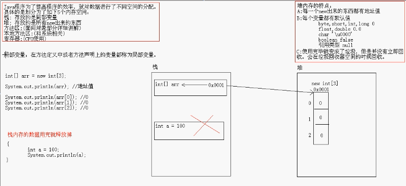

## 数据类型

#### 整型

| 类型  | 存储需求 | 取值范围     |
| ----- | -------- | ------------ |
| long  | 8 字节   | -2^63~2^61-1 |
| int   | 4 字节   | -2^31~2^31-1 |
| short | 2 字节   | -2^15~2^15-1 |
| byte  | 1 字节   | -2^7~2^7-1   |

#### 浮点类型

| 类型   | 存储需求 | 取值范围                                  |
| ------ | -------- | ----------------------------------------- |
| float  | 4 字节   | 正负 3.40282347E+28F(有效 6~7 位)         |
| double | 8 字节   | 正负 1.79769313486231570E+308(有效 15 位) |

```java
// 检测是否是非数值
Double.isNaN(x)
```

#### char 类型

用于表示单个字符,用''包裹,可表示\u0000~\uFFFF

```java
// unicode转义字符会在解析代码之前得到处理
"\u0022+\u0022"因为\u0022是",所以解析之后就是一个空字符串
```

#### boolean 类型

boolean 只有 2 个值,且整型值和布尔类型值不能转换

## 变量与常量

#### 变量

变量声明: 数据类型 变量名 = 初始化值;  
变量必须先初始化再使用

java10 如果能从初始化值推断出变量类型,可以不声明类型:var greeting = "Hello";

#### 常量

用 final 关键字声明,常量一旦被赋值,就不能再更改,常量名全大写

## 运算符

#### 算数运算符

+,-,\*,/,%  
/两侧都为整数时为整除,否则为浮点除,整数被 0 除报错,浮点被 0 除为 NaN 或无穷大

+=,-=,\*=,/=,%=
如果运算符 2 侧数据类型不同,会发生强制类型转换

```java
int x;
x+=3.5; // === x = (int)(x+3.5)
```

前置后置++和--

#### 数值类型之间的转换

当二元运算符连接两个值时(n+f):

- 有 double 类型则全转 double 类型
- 有 float 类型则全转 float 类型
- 有 long 类型则全转 long 类型
- 否则全转 int 类型

强制类型转换:(转换类型) 转换的值

#### 比较和逻辑运算符

> ,<,<=,>=,==,!=,&&,||,!,? :

#### 位运算符

位运算要把数据换算成二进制

&: 有 false 则 false,不短路,两边是数据是位运算,有 0 则 0  
|:有 true 则 true,不短路,两边是数据是位运算,有 1 则 1  
^:相同为 false,不同为 true,两边是数据是位运算,相同则 0,不同则 1
~:按位取反,0 变 1,1 变 0,且计算出来为补码

```java
int a = 3; // 0000011
int b = 4; // 0000100
a&b; // 00000000
a|b; // 00000111
a^b; // 00000111
~a; //补码11111100=>反码11111011=>原码00000100
```

异或的特性: 一个数据对另一个数据异或 2 次,该数本身不变

```java
int a = 2;
int b = 3;
a^b^b; // 2
a^b^a; // 3
交换2个变量
a = a^b;
b = a^b;
a = a^b;
```

<<:左移操作补码,左边最高位丢弃,右边补 0,结论把左边的数据\*2 的移动次幂  
\>>:右移操作补码,最高位是 0,左边补 0,最高位是 1,左边补 1  
\>>>:无符号右移操作补码,无论最高位是 0 还是 1,左边补齐 0

```java
3<<2 // 3*2^2 ==>12
```

## 输入与输出

#### 读取输入

Scanner 步骤:

1. 导包`import java.util.Scanner`
2. 创建键盘录入对象`Scanner sc = new Scanner(System.in)`
3. 通过对象读取数据`int x = sc.nextInt()`

Console 步骤:

1. 导包`import java.io.Console;`
2. 创建 Console 对象`Console con = System.console();`
3. 读取数据`char[] passws = con.readPassword("password:")`

## 流程控制

#### 块级作用域

块确定了变量的作用域,不能在嵌套的两个块中声明同名的变量

#### 分支结构

if 语句

```java
if(比较表达式){
    语句体;
}else if(比较表达式2){
    语句体2;
}else{
    语句体3;
}
```

switch 语句

```java
switch(表达式):
    case 值1:
        语句体;
        break;
    case 值2:
        语句体;
        break;
    default:
        语句体;
        break;
```

表达式的取值:byte,short,int,char,枚举,String  
case 后面的值只能是常量,不能是变量

#### 循环语句

for 循环

```java
for(初始化语句;判断条件语句;控制步进语句){
    循环体语句;
}
```

while 循环

```java
初始化语句;
while(判断条件语句){
    循环体语句;
    控制步进语句;
}
```

do...while 循环

```java
初始化语句;
do{
    循环体语句;
}while(判断条件语句)
```

break:跳到循环结尾  
continue:跳到循环开头  
循环开头可以加上`名字:`,然后`break 名字`就可以跳出多重循环

## 数组

数组是存储同一种数据类型的多个元素的容器,既可以存储基本类型,也可以存储引用类型,一旦创建了数组就不能再改变数组的长度

定义数组的方式:

1. 数据类型[] 变量名
2. 数据类型 变量名[]

数组初始化方式:

1. 动态初始化:只指定长度,有系统为数组分配初始值`int[] arr = new int[3]`
2. 静态初始化:指定每个数组的初始值,由系统决定长度`int[] arr = {1,2,3,4,5}`

数组元素可通过下标(索引)访问`数组名[索引]`  
打印数组的结果是数组的地址值  
数组名.length 可以获取数组的长度



二维数组格式:数据类型[][] 变量名=new 数据类型[m][n];

- m 表示这个二维数组有多少个一位数组
- n 表示每一个一维数组有多少个元素

不规则数组: 数据类型[][] 变量名=new 数据类型[m][];

- 不规则数组的一维数组每个长度是可以不同的
