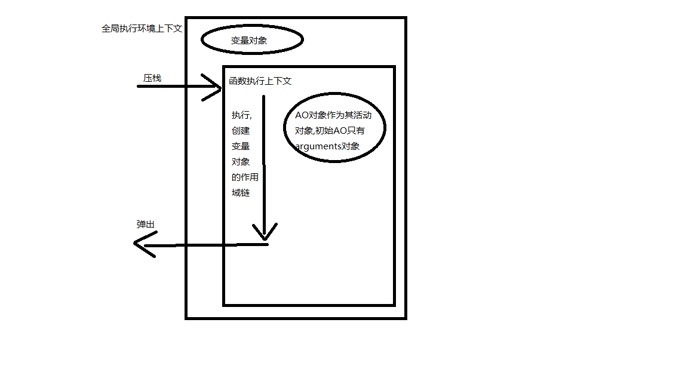

## 基本类型和引用类型的值

基本数据类型可已操作保存在变量中的实际的值,所以基本数据类型是按值访问的

引用类型的值时保存在内存中的对象,js 不能直接访问内存中的位置,只能操作对象的引用,所以引用类型是按引用访问的

#### 复制变量值

复制基本类型的变量是创建一个新的一样的值并赋值给变量,两个变量值一样,但互不相关

复制引用类型的变量是复制的指向同一个对象的指针,所以通过一个变量修改值,另一个变量的值也会改变

#### 传递参数

函数的参数都是按值访问的,向参数传递一个基本类型的值时,被传递的值被复制给一个局部变量,向参数传递引用类型的值时,会把这个值的地址值复制给一个局部变量

```js
function setName(obj) {
  obj.name = 'Nicholas';
  obj = new Object();
  obj.name = 'Greg';
}
var person = new Object();
setName(person);
alert(person.name); // "Nicholas"
// 如果函数参数是按照引用传递的,name将obj赋值为新对象后,person也会被修改为新对象
```

#### 检测类型

检测引用类型可以用 instanceof 操作符

```js
person instanceof Object; // true
colors instanceof Array;
```

## 执行环境和作用域

每个执行环境(执行上下文)都有一个变量对象,该环境中定义的所有变量和函数都保存在这里。  
全局执行环境是最外围的一个执行环境  
函数都有自己的执行环境,执行流进入函数时,函数的环境被推入执行栈,函数执行结束,执行栈将其环境弹出,该环境销毁,保存在其中的变量和函数随之销毁。

代码在执行上下文中执行时,会创建变量对象的作用域链(保证对执行上下文能够访问的所有变量和函数的有序访问),如果执行上下文是一个函数,将其活动对象作为变量对象,最开始 AO 对象只有一个 arguments 对象


#### 延长作用域链

有些语句可以在作用域链的前端增加一个变量对象,该变量对象会在代码执行后被移除

- try-catch 语句的 catch 块
- with 语句

```js
// with语句不会形成独立的作用域,所以url能在with外部访问
function buildUrl() {
  var qs = '?debug=true';
  with (location) {
    var url = href + qs;
  }
  return url;
}
```

## 垃圾收集

#### 标记清除

当变量进入环境时,该变量就会被标记为"进入环境",在垃圾收集器运行时,会把内存中存储的所有变量都加上标记,然后去掉被标记为"进入环境"的变量和被环境中变量引用的变量的标记,之后还有标记的变量被视为准备删除的变量。

#### 引用计数

引用计数就是跟踪记录每个值被引用的次数,当引用次数变为 0 的时候,将被视为准备删除的变量,垃圾收集器下次运行时,就会释放那些变量。

- IE:window.CollectGarbage()
- Opera7 及以上:window.opera.collect()

#### 内存管理

将不再使用的全局变量或全局对象的值设为 null 来释放其引用
