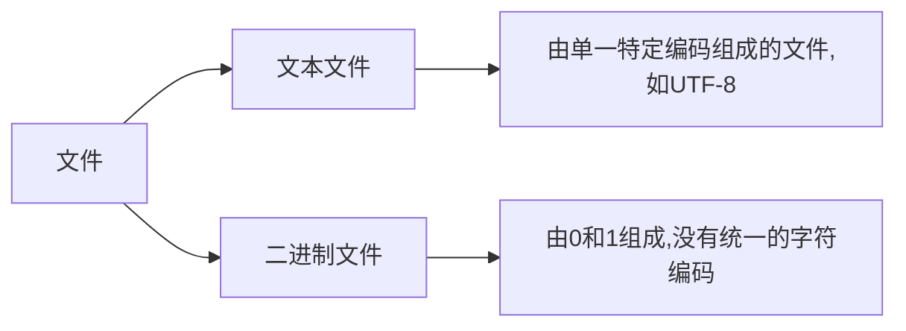

## 文件

文件是存储在辅助存储器上的数据序列



**文件的处理步骤:打开-操作-关闭**

###### 文件的打开

<变量名> = open(<文件路径>,<打开模式>)

| 文件卡开模式 | 描述                                                   |
| :----------: | ------------------------------------------------------ |
|     'r'      | 只读模式,默认值,如果文件不存在,返回 FileNotFoundError  |
|     'w'      | 覆盖写模式,文件不存在则创建文件,存在则完全覆盖         |
|     'x'      | 创建写模式,文件不存在则创建,存在则返回 FileExistsError |
|     'a'      | 追加写模式,文件不存在则创建,存在则在文件最后追加内容   |
|     'b'      | 二进制文件模式                                         |
|     't'      | 文本文件模式,默认值                                    |
|     '+'      | 与 r/w/x/a 一同使用,在原功能基础上增加同时读写功能     |

###### 文件关闭

<变量名>.close()

###### 文件读取方法

| 方法                  | 描述                                                                |
| --------------------- | ------------------------------------------------------------------- |
| <f>.read(size=-1)     | 读入全部内容,如果给出参数,读入前 size 长度                          |
| <f>.readline(size=-1) | 读入一行内容,如果给出参数,读入该行前 size 长度                      |
| <f>.readlines(hint=1) | 读入文件所有行,以每行为元素形成一个列表,如果给出参数,读入前 hint 行 |

```python
f = open("t.txt","rt")
s = f.read(size = 2) // s为中国两个字
s = f.readline() // 中国是一个伟大的国家
s = f.readlines() // ['中国是一个伟大的国家']

读入文件最优方法:分行读入,逐行处理
fname = input("请输入要打开的文件名称:")
fo = open(fname,'r')
for line in fo: // fo是文件句柄
  print(line)
fo.close()
```

###### 文件写入方法

| 方法                  | 描述                                                                        |
| --------------------- | --------------------------------------------------------------------------- |
| <f>.write(s)          | 向文件写入一个字符串或字节流                                                |
| <f>.writelines(lines) | 将一个元素全为字符串的列表写入文件                                          |
| <f>.seek(offset)      | 改变当前文件操作指针的位置,offset 含义如下:0-文件开头;1-当前位置;2-文件结尾 |

```python
f.write("中国是一个伟大的国家")
f.writelines(["中国","法国","美国"])
f.seek(0) // 回到文件开头
```

## 数据格式化

#### 一维数据

有序数据用列表,无序数据用集合

###### 一维数据存储方式

1. 空格分隔: 使用一个或多个空格分隔进行存储,不换行,但数据中不能存在空格
2. 逗号分隔: 使用英文半角逗号分隔数据进行存储,不换行,但书籍中不能有英文逗号
3. 其他符号: 使用其他不常用的符号分隔数据

#### 二维数据

可用二维列表来表示二维数据

## wordcloud

```
安装
pip install wordcloud
```

```python
w = wordcloud.WordCloud() // 创建词云对象
```

| WordCloud()参数  | 描述                                            |
| ---------------- | ----------------------------------------------- |
| width            | 指定词云对象生成图片的宽度,默认 400 像素        |
| height           | 指定词云对象生成图片的高度,默认 200 像素        |
| min_font_size    | 指定词云中字体的最小字号,默认 4 号              |
| max_font_size    | 指定词云中字体的最大字号,根据高度自动调节       |
| font_step        | 指定词云中字体字号的步进间隔,默认为 1           |
| font_path        | 指定字体文件的路径,默认为 None                  |
| max_words        | 指定词云显示的最大单词数量,默认 200             |
| stop_words       | 指定词云的排除词列表,即不显示的单词列表         |
| mask             | 指定词云形状,默认为长方形,需要引用 imread()函数 |
| background_color | 指定词云图片的背景颜色,默认为黑色               |

```python
mk = imread("pic.png")
w = wordcloud.WordCloud(mask=mk)
```

| 方法                | 描述                               |
| ------------------- | ---------------------------------- |
| w.generate(txt)     | 向 WordCloud 对象 w 中加载文本 txt |
| w.to_file(filename) | 将词云输出为图像文件,.png 或.jpg   |

```python
import wordcloud
c = wordcloud.WordCloud()
c.generate("wordcloud by Python")
c.to_file("output.png")
```
