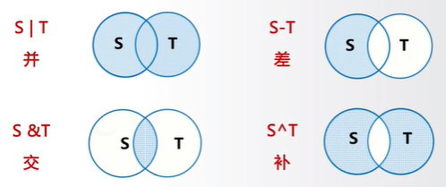
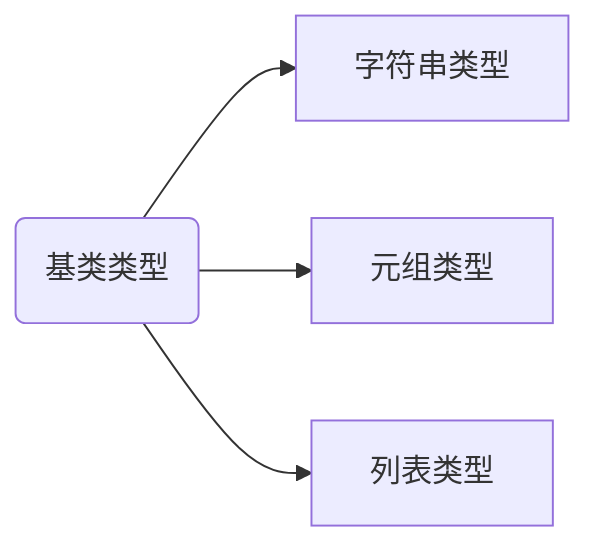
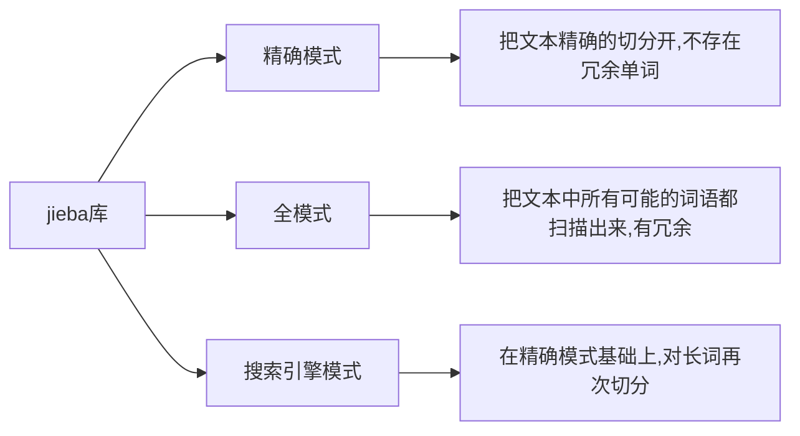

## 组合数据类型

#### 集合类型

集合是多个元素的无序组合,每个元素唯一,集合元素不可更改(不能是可变数据类型)

集合用{}表示,元素之间用逗号分隔,建立集合类型用{}或 set(),建立空集合类型,必须用 set()

```python
A = {"python",123,("python",123)}

B = set("pypy123") // {'1','p','2','3','y'}
```


操作符|说明
---|---
S\|T|返回一个新集合,包括在集合 S 和 T 中的所有元素
S-T|返回一个新集合,包括在集合 S 但不在 T 中的所有元素
S&T|返回一个新集合,包括同时在集合 S 和 T 中的元素  
S^T|返回一个新集合,包括集合 S 和 T 中的非相同元素
S<=T 或 S<T|返回 True/False,判断 S 和 T 的子集关系
S>=T 或 S>T|返回 True/False,判断 S 和 T 的包含关系
S\|=T|更新集合 S,包含在集合 S 和 T 中的所有元素
S-=T|更新集合 S,包含在集合 S 但不在 T 中的元素
S&=T|更新集合 S,包含同时在集合 S 和 T 中的元素
S^=T|更新集合 S,包含集合 S 和 T 中的非相同元素

| 集合处理方法 | 描述                                                                  |
| ------------ | --------------------------------------------------------------------- |
| S.add(x)     | 如果 x 不在集合 S 中,将 x 增加到 S                                    |
| S.discard(x) | 移除 S 中元素 x,如果 x 不在集合 S 中,不报错                           |
| S.remove(x)  | 移除 S 中元素 x,如果 x 不在集合 S 中,产生 KeyError 异常               |
| S.clear()    | 移除 S 中所有元素                                                     |
| S.pop()      | 随机返回 S 的一个元素,并删除 S 中这个元素,若 S 为空产生 KeyError 异常 |
| S.copy()     | 返回集合 S 的一个副本                                                 |
| len(S)       | 返回集合 S 的元素个数                                                 |
| x in S       | 判断 S 中元素 x,x 在集合 S 中,返回 True,否则返回 False                |
| x not in S   | 判断 S 中元素 x,x 不在集合 S 中,返回 True,否则返回 False              |
| set(x)       | 将其他类型变量转变为集合类型                                          |

#### 序列类型

序列是具有先后关系的一组元素,元素类型可以不同,元素可以通过下标访问



| 序列操作符   | 描述                                                |
| ------------ | --------------------------------------------------- |
| x in s       | 如果 x 是序列 s 的元素,返回 True,否则返回 False     |
| x not in s   | 如果 x 是序列 s 的元素,返回 False,否则返回 True     |
| s+t          | 连接两个序列                                        |
| s\*n 或 n\*s | 将序列 s 复制 n 此                                  |
| s[i]         | 索引,返回 s 中的第 i 个元素                         |
| s[i:j<:k>]   | 切片,返回序列 s 中第 i 到 j 以 k 为步长的元素子序列 |

| 序列函数                    | 描述                                                   |
| --------------------------- | ------------------------------------------------------ |
| len(s)                      | 返回序列 s 的长度                                      |
| min(s)                      | 返回序列 s 的最小元素,s 中元素需要可比较               |
| max(s)                      | 返回序列 s 的最大元素,s 中元素需要可比较               |
| s.index(x)或 s.index(x,i,j) | 返回序列 s 从 i 开始到 j 位置中第一次出现元素 x 的位置 |
| s.count(x)                  | 返回序列 s 中出现 x 的总次数                           |

元组是一种序列类型,一旦创建就不能被修改,使用()或 tuple()创建,元素间用逗号分隔

列表是一种序列类型,创建后可修改,使用[]或 list()创建,元素间用逗号分隔
列表类型函数|描述
---|---
ls[i] = x|替换列表 ls 第 i 个元素为 x
ls[i:j:k]=lt|用列表 lt 替换为 ls 切片后所对应元素子列表
del ls[i]|删除列表 ls 中第 i 元素
del ls[i:j:k]|删除列表 ls 中第 i 到第 j 以 k 为步长的元素
ls += lt|更新列表 ls,将列表 lt 元素增加到列表 ls 之后
ls\*=n|更新列表 ls,其元素重复 n 次
ls.append(x)|在列表 ls 最后增加一个元素 x
ls.clear()|删除列表 ls 中所有元素
ls.copy()|生成一个新列表,赋值 ls 中所有元素
ls.insert(i,x)|在列表 ls 的第 i 个位置增加元素 x
ls.pop(i)|将列表 ls 中第 i 位置元素去除并删除该元素
ls.remove(x)|将列表 ls 中出现的第一个元素 x 删除
ls.reverse()|将列表 ls 中的元素反转

#### 字典类型

映射是一种键(索引)和值(数据)的对应

字典类型是"映射"的体现 ,是键值对的集合,键值对之间无序,采用{}或 dict()创建

| 函数               | 描述                                                    |
| ------------------ | ------------------------------------------------------- |
| del d[k]           | 删除字典 d 中键 k 对应的数据值                          |
| k in d             | 判断键 k 是否在字典 d 中,如果在返回 True,否则返回 False |
| d.keys()           | 返回字典 d 中所有的键信息                               |
| d.values()         | 返回字典 d 中所有的值信息                               |
| d.items()          | 返回字典 d 中所有键值对信息                             |
| d.get(k,<default>) | 键 k 存在,返回相应值,不在则返回<default>值              |
| d.pop(k,<default>) | 键 k 存在,则取出相应值并删除,不在则返回<default>值      |
| d.popitem()        | 随机从字典 d 中取出一个键值对,以元组形式返回            |
| d.clear()          | 删除所有的键值对                                        |
| len(d)             | 返回字典 d 中元素的个数                                 |

## jieba 库

中文文本需要通过分词获得单个的词语



| 函数                       | 描述                                             |
| -------------------------- | ------------------------------------------------ |
| jieba.lcut(s)              | 精确模式,返回一个列表类型的分词结果              |
| jieba.lcut(s,cut_all=True) | 全模式,返回一个列表类型的分词结果,存在冗余       |
| jieba.lcut_for_search(s)   | 搜索引擎模式,返回一个列表类型的分词结果,存在冗余 |
| jieba.add_word(w)          | 向分词词典增加新词                               |
