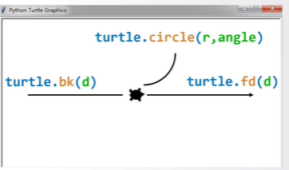

turtle.setup(width,height,startx,starty): 设置窗体大小及位置,后 2 个可选

**turtle 的绝对坐标体系**

- 海龟在画布的正中心,可用 turtle.goto(x,y)来移动海龟的位置

**turtle 的海龟坐标体系**

- bk(d):表示向海龟的后方移动 d 个像素
- fd(d):表示向海龟前方移动 d 个像素
- circle(r,range):表示以海龟当前位置左侧一个点为圆心进行曲线运行

**turtle 空间坐标方向**
turtle.seth(deg):只改变海龟行进方向,不去绘制图形
**turtle 海龟坐标方向**
turtle.left(deg):向左改变方向  
turtle.right(deg):向右改变方向  
turtle.colormode(mode):改变颜色模式,值为 1.0 表示使用 rgb 小数模式,值为 255 表示使用 rgb 整数模式

**turtle 画笔控制函数**
penup(): 抬起画笔,海龟在飞行
pendown():画笔落下
pensize():画笔宽度
pencolor():画笔颜色

range(N):产生循环计数序列(0 到 N-1 的整数序列)
range(M,N):产生 M 到 N-1 的整数序列

import 库名
from 库名 import \*  
import 库名 as 库别名
