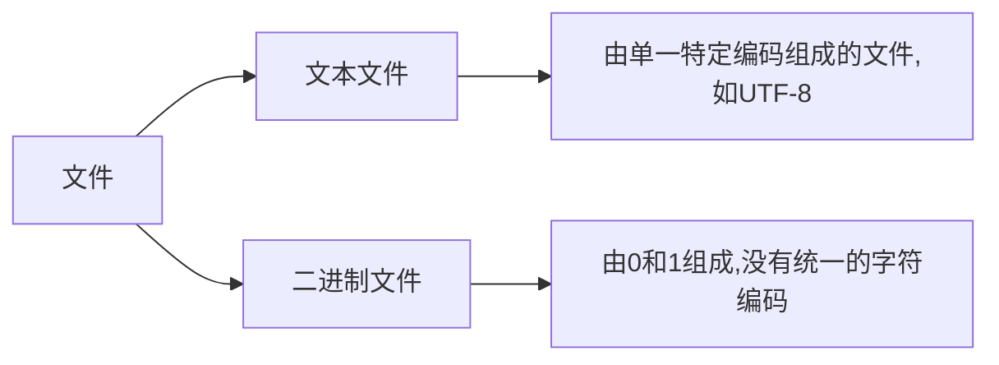

## 文件

文件是存储在辅助存储器上的数据序列



**文件的处理步骤:打开-操作-关闭**

###### 文件的打开

<变量名> = open(<文件路径>,<打开模式>)

| 文件卡开模式 | 描述                                                   |
| ------------ | ------------------------------------------------------ |
| 'r'          | 只读模式,默认值,如果文件不存在,返回 FileNotFoundError  |
| 'w'          | 覆盖写模式,文件不存在则创建文件,存在则完全覆盖         |
| 'x'          | 创建写模式,文件不存在则创建,存在则返回 FileExistsError |
| 'a'          | 追加写模式,文件不存在则创建,存在则在文件最后追加内容   |
| 'b'          | 二进制文件模式                                         |
| 't'          | 文本文件模式,默认值                                    |
| '+'          | 与 r/w/x/a 一同使用,在原功能基础上增加同时读写功能     |

###### 文件关闭

<变量名>.close()

###### 文件读取方法

| 方法                  | 描述                                                                |
| --------------------- | ------------------------------------------------------------------- |
| <f>.read(size=-1)     | 读入全部内容,如果给出参数,读入前 size 长度                          |
| <f>.readline(size=-1) | 读入一行内容,如果给出参数,读入该行前 size 长度                      |
| <f>.readlines(hint=1) | 读入文件所有行,以每行为元素形成一个列表,如果给出参数,读入前 hint 行 |

```python
f = open("t.txt","rt")
s = f.read(size = 2) // s为中国两个字
s = f.readline() // 中国是一个伟大的国家
s = f.readlines() // ['中国是一个伟大的国家']

读入文件最优方法:分行读入,逐行处理
fname = input("请输入要打开的文件名称:")
fo = open(fname,'r')
for line in fo: // fo是文件句柄
  print(line)
fo.close()
```

###### 文件写入方法

方法|描述
<f>.write(s)|向文件写入一个字符串或字节流
<f>.writelines(lines)|将一个元素全为字符串的列表写入文件
<f>.seek(offset)|改变当前文件操作指针的位置,offset 含义如下:0-文件开头;1-当前位置;2-文件结尾

```python
f.write("中国是一个伟大的国家")
f.writelines(["中国","法国","美国"])
f.seek(0) // 回到文件开头
```

## 数据格式化
