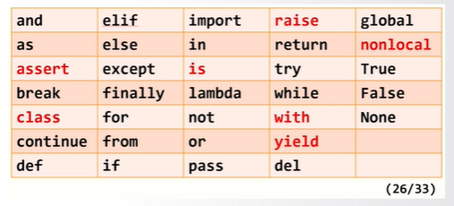
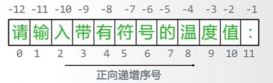

```python
# TempCovert
TempStr = input("请输入带有符号的温度值");
if TempStr[-1] in ['f','F']:
    C = (eval(TempStr[0:-1])-32)/1.8
    print('结果为{:.2f}C'.format(C))
elif TempStr[-1] in ['c','C']:
    F = eval(TempStr[0:-1])*1.8+32
    print('结果为{:.2f}F'.format(F))
else:
    print("格式错误")

```

## 注释

单行注释: 以#开头进行单行注释
多行注释: 以'''开头和结尾

## 保留字



## 字符串

字符串由一对单引号或双引号表示  
字符串是字符的有序序列,可以对字符进行索引  


索引: 返回字符串中单个字符 <字符串>[M]
切片: 返回字符串中一段字符子串 <字符串>[M:N]

## 列表

由 0 或多个数据组成的有序序列

使用保留字 in 可判断数据是否在列表中

## print 函数

print()函数的格式化: print("{:.2f}".format(C))
{}是槽,format 中的参数将被格式化后填充到槽中

## eval 评估函数

去掉参数最外侧的引号并执行余下语句
eval(<字符串或字符变量>)

```python
eval('1'); // 结果为数字类型的1
eval('1+2'); // 结果为数字类型的3
```
