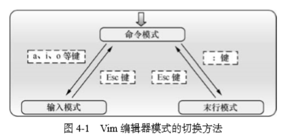

## Vim 编辑器与 Shell 脚本

#### Vim 文本编辑器

Vim 中设置了三种模式:命令模式、末行模式和编辑模式

- 命令模式:控制光标移动,可对文本进行复制,粘贴,删除和查找等工作
- 输入模式:正常的文本录入
- 末行模式:保存或退出文档,以及设计编辑环境
  

**vim 中常用的命令**
命令|描述
---|---
dd|删除(剪切)光标所在整行  
5dd|删除(剪切)从光标处开始的 5 行
yy|复制光标所在的整行
5yy|复制从光标处开始的 5 行
n|显示搜索命令定位到的下一个字符串
N|显示搜索命令定位到的上一个字符串
u|撤销上一步操作
P|将之前删除的(dd)或复制(yy)过的数据粘贴到光标后面

**末行模式下可用的命令**
命令|描述
---|---
:w|保存
:q|退出
:q!|强制退出(放弃对文档的修改内容)
:wq!|强制保存退出
:set nu|显示行号
:set nonu|不显示行号
:命令|执行该命令
:整数|跳转到该行
: s/one/two|将光标所在行的第一个 one 替换成 two
: s/one/two/g|将光标所在行的所有 one 替换成 two
:%s/one/two/g|将全文中的 one 替换成 two
/字符串|在文本中从上至下搜索该字符串
?字符串|在文本中从下至上搜索该字符串

#### 编写 Shell 脚本

```shell
#!/bin/bash // #!脚本声明
#For Example BY linuxprobe.com // #注释信息
pwd
ls -al
```

执行 shell 脚本`bash 脚本名`或者输入脚本的完整路径

###### 接收用户的参数

在运行脚本的时候,脚本名称后面可加脚本参数,$0对应脚本名字,$1 对应第一个参数...,\$\#对应参数个数,$\*对应多有位置的参数值,\$?对应显示上一次命令的返回值,0 为上一条命令执行成功

###### 判断用户的参数

测试语句格式`[ 条件表达式 ]`

**文本测试所用的参数**
运算符|描述
---|---
-d|测试文件是否为目录类型
-e|测试文件是否存在
-f|判断是否为一般文件
-r|测试当前用户是否有权限读取
-w|测试当前用户是否有权写入
-x|测试当前用户是否有权限执行

```shell
[ -d /etc/fstab ] && echo "exist" || echo "error"// &&只有前面命令执行成功才会执行后面的命令,||只有测试语句失败后才会执行
[ ! $USER = root ] && echo "user" || echo "root" // !把测试结果取反
```

**可用的整数比较运算符**
运算符|描述
---|---
-eq|是否等于
-ne|是否不等于
-gt|是否大于
-lt|是否小于
-le|是否小于等于
-ge|是否大于等于

```shell
[ 10 -gt 10 ] && echo "yes" || echo "no"
```

**常见的字符串比较运算符**
运算符|描述
---|---
=|比较字符串内容是否相同
!=|比较字符串内容是否不同
-z|判断字符串内容是否为空

#### 流程控制语句

###### if 条件测试语句

if 条件语句的单分支结构由 if、then、fi 关键词组成,只有在条件成立之后才执行预设的命令

```shell
if 条件测试操作
  then 命令序列1  //条件成立后执行
elif 条件测试操作2
  then 命令序列2
else
  命令序列2  //条件判断不成立后执行
fi // 结束判断
```

###### for 条件循环语句

```shell
for 变量名 in 取值列表
do
  命令序列
done
```

###### while 条件循环语句

```shell
while 条件测试操作
do
命令序列
done
```

###### case 条件测试语句

```shell
case 变量值 in
模式1)
  命令序列1
  ;;
模式2)
  命令序列2
  ;;
  ......
*)
  默认命令序列
esac
```

#### 计划任务服务程序

###### 一次性计划任务

```shell
at 时间 // 回车之后设置命令,设置好命令按ctrl+D

at -l // 查看设置好但未执行的一次性计划任务

at -c 任务序列 // 和at -l一样,但是能查到任务种类

atrm 任务序列 // 取消该序列的一次性任务
```

###### 周期性计划任务

```shell
crontab -e // 创建、编辑计划任务的命令

crontab -l // 查看当前计划任务的命令

crontab -r // 删除某条计划任务的命令
```

crond 服务设置任务的参数格式:分-时-日-月-星期-命令(必须以命令形式);多个时间可用逗号分隔,还可用-表``示连续的时间周期,/表示执行任务的时间间隔`*/2每隔2分钟执行这个命令`
