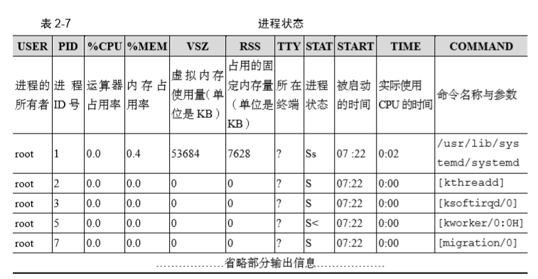
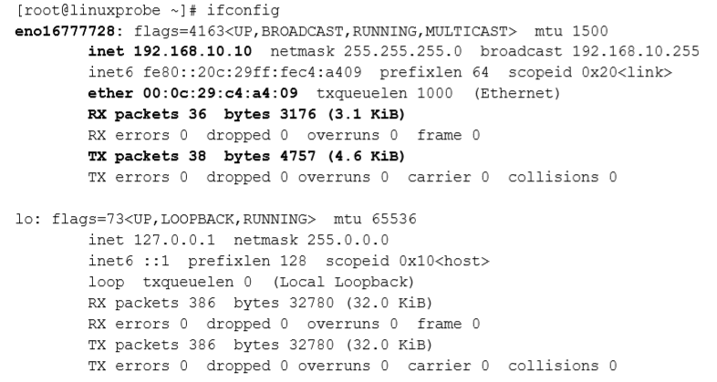
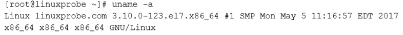
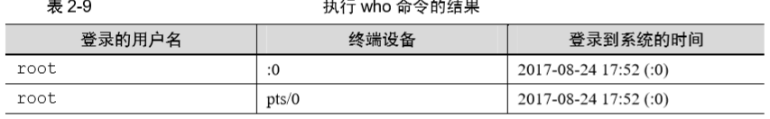

## 常用 Linux 命令

#### RPM

| 描述                            | 命令                  |
| ------------------------------- | --------------------- |
| 安装软件的命令格式              | rpm -ivh filename.rpm |
| 升级软件的命令格式              | rpm -Uvh filename.rpm |
| 卸载软件的命令格式              | rpm -e filename.rpm   |
| 查询软件描述信息的命令格式      | rpm -qpi filename.rpm |
| 列出软件文件信息的命令格式      | rpm -qpi filename.rpm |
| 查询文件属于哪个 RPM 的命令格式 | rpm -qf filename      |

#### Yum

| 描述                         | 命令                      |
| ---------------------------- | ------------------------- |
| 列出所有仓库                 | yum repolist all          |
| 列出仓库中所有的软件包       | yum list all              |
| 查看软件包信息               | yum info 软件包名称       |
| 安装软件包                   | yum install 软件包名称    |
| 重新安装软件包               | yum reinstall 软件包名称  |
| 升级软件包                   | yum update 软件包名称     |
| 移除软件包                   | yum remove 软件包名称     |
| 清除所有仓库的缓存           | yum clean all             |
| 检查可更新的软件包           | yum check-update          |
| 查看系统中已经安装的软件包组 | yum grouplist             |
| 安装指定的软件包组           | yum groupinstall 软件包组 |
| 移除指定的软件包组           | yum groupremove 软件包组  |
| 查询指定的软件包组信息       | yum groupinfo 软件包组    |

#### 查看帮助文档

```
linux常见命令格式
命令名称 [命令参数] [命令对象]
```

命令参数可用长格式(完整的选项名称),也可以用短歌诗(单个字母的缩写),前者用--作为前缀,后者用-作为前缀
说明|命令
---|---
长格式|man --help
短格式|man -h

**man 命令常用按键**
按键|描述
---|---
空格|向下翻一页
page down|向下翻一页
page up|向上翻一页
home|前往首页
end|前往尾页
/|从上至下搜索某个关键词,如"/linux"
?|从下至上搜索某个关键词,如"?linux"
n|定位到下一个搜索到的关键词
N|定位到上一个搜多到的关键词
q|退出帮助文档

**帮助文档信息的结构**
结构名称|描述
---|---
NAME|命令的名称
SYNOPSIS|参数的大致使用方法
DESCRIPTION|介绍说明
EXAMPLES|演示(附带简单说明)
OVERVIEW|概述
DEFAULTS|默认的功能
ENVIRONMENT |环境变量
FILES| 用到的文件
SEE ALSO| 相关的资料
HISTORY| 维护历史与联系方式

#### 常用系统工作命令

###### 1.echo 命令

echo 命令用于在终端输出字符串或变量提取后的值，格式为“echo [字符串 | $变量]”。

```
echo www.baidu.com // 输出www.baidu.com
echo $SHELL // 输出/bin/bash
```

###### 2. date 命令

date 命令用于显示及设置系统的时间或日期，格式为“date [选项][+指定的格式]”

| 格式 | 作用             |
| ---- | ---------------- |
| %t   | 跳格[tab 键]     |
| %H   | 小时(0-23)       |
| %I   | 小时(0-12)       |
| %M   | 分钟(0-59)       |
| %m   | 月份             |
| %Y   | 年               |
| %S   | 秒               |
| %j   | 今年中的第几天   |
| %d   | 一个月中的第几天 |

```
date "+%Y-%m-%d%t%H:%M:%S" // 输出2020-04-19 tab分隔 14:34:30
```

###### reboot 命令

reboot 命令用于重启系统，其格式为 reboot。
由于重启计算机这种操作会涉及硬件资源的管理权限，因此默认只能使用 root 管理员来 重启

###### poweroff 命令

poweroff 命令用于关闭系统，其格式为 poweroff
也是只能由管理员才可操作

###### wget 命令

wget 命令用于在终端中下载网络文件，格式为“wget [参数] 下载地址”。

| 参数     | 描述                              |
| -------- | --------------------------------- |
| -b       | 后台下载模式                      |
| -p       | 下载到指定目录                    |
| -t       | 最大尝试次数                      |
| -c       | 断点续传                          |
| -P(大写) | 下载页面内所有资源,包括图片视频等 |
| -r       | 递归下载                          |

###### ps 命令

ps 命令用于查看系统中的进程状态，格式为“ps [参数]”。
参数|描述
---|---
-a|显示所有进程(包括其他用户的进程)
-u|用户以及其他详细信息
-x|显示没有控制终端的进程

**Linux 常见进程状态**
状态|描述
---|---
R(运行)|进程正在运行或在运行队列中等待
S(中断)|进程处于休眠中,当某个条件形成后或者接收到信号时,则脱离该状态
D(不可中断)|进程不响应系统异步信号,即便用 kill 命令也不能将其中断
Z(僵死)|进程已经终止,但进程描述依旧存在,知道父进程调用 wait4()系统函数后将进程释放
T(停止)|进程收到停止信号后停止运行



###### top 命令

top 命令用于动态地监视进程活动与系统负载等信息，其格式为 top。

top 命令结果的前 5 行为系统整体的同级信息:

1. 系统时间、运行时间、登录终端数、系统负载（三个数值分别为 1 分钟、5 分钟、15 分钟内的平均值，数值越小意味着负载越低）。
2. 进程总数、运行中的进程数、睡眠中的进程数、停止的进程数、僵死的进程 数。
3. 用户占用资源百分比、系统内核占用资源百分比、改变过优先级的进程资源 百分比、空闲的资源百分比等。
4. 物理内存总量、内存使用量、内存空闲量、作为内核缓存的内存量。
5. 虚拟内存总量、虚拟内存使用量、虚拟内存空闲量、已被提前加载的内存量。

###### pidof 命令

pidof 命令用于查询某个指定服务进程的 PID 值，格式为“pidof [参数][服务名称]”。  
每个进程的进程号(PID)是唯一的

```
pidof sshd
```

###### kill 命令

kill 命令用于终止某个指定 PID 的服务进程，格式为“kill [参数][进程 pid]”。

```
kill 1471
```

###### killall 命令

killall 命令用于终止某个指定名称的服务所对应的全部进程，格式为：“killall [参数][进 程名称]”。

```
killall httpd
```

#### 系统状态监测命令

###### ifconfig 命令

ifconfig 命令用于获取网卡配置与网络状态等信息，格式为“ifconfig [网络设备][参数]” 。

eno16777728: 网卡名称
inet 192.168.10.10 是 ip 地址
ether 后面是物理网卡地址(MAC 地址)  
RX 为接受数据包的个数及累计流量  
TX 为发送数据包的个数及累计流量

###### uname 命令

uname 命令用于查看系统内核与系统版本等信息，格式为“uname [-a]”。

分别对应当前系统的内核名称、主 机名、内核发行版本、节点名、系统时间、硬件名称、硬件平台、处理器类型以及操作系统 名称

```
查看当前系统版本的详细信息
cat /etc/redhat-release // Red Hat Enterprise Linux Server release 7.0 (Maipo)
```

###### uptime 命令

uptime 用于查看系统的负载信息，格式为 uptime
运行结果为 top 命令的第一行

###### free 命令

free 用于显示当前系统中内存的使用量信息，格式为“free [-h]”。


###### who 命令

who 用于查看当前登入主机的用户终端信息，格式为“who [参数]”。


###### last 命令

last 命令用于查看所有系统的登录记录，格式为“last [参数]”。

###### history 命令

history 命令用于显示历史执行过的命令，格式为“history [-c]”。
默认显示最近 1000 条命令,还可以通过自定义/etc/profile 文件中的 HISTSIZE 变量值来更改记录条数  
可用"!编码数字"来重复执行某一条命令
-c 参数为清空本机上的历史记录

###### sosreport 命令

sosreport 命令用于收集系统配置及架构信息并输出诊断文档，格式为 sosreport
当系统出现故障时,可用此明林来获取系统运行状态和服务配置信息的压缩文件
