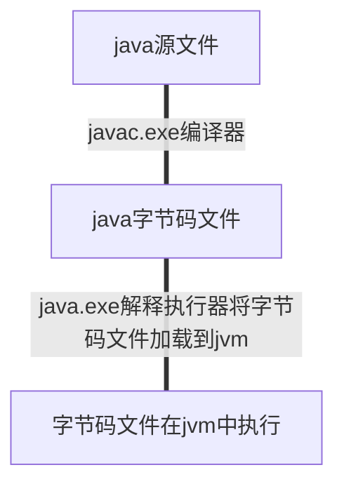
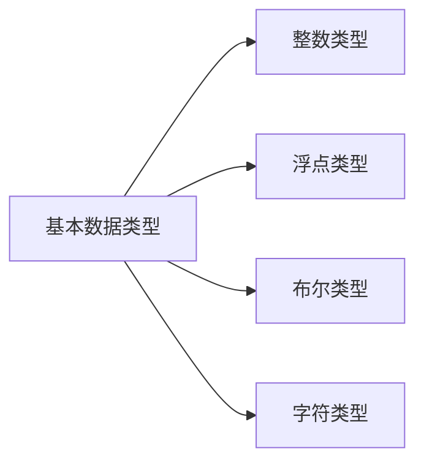

# 变量、数据类型

#### 编译和 java 程序运行关系

环境变量的作用是是 javac 等命令可以在任意路径下使用  
JAVA_HOME 保存了 javac 的安装目录  
classpath 作用是让 class 文件在任意路径下都可以执行

## java 基本数据类型

#### 整数类型

整数类型分为 byte(-128~127)、short(-32768~32767)、int(-2147483648~2147482647) 和 long
负数:-2^字节数\*8-1  
正数:(2^字节数\*8-1)-1

#### 浮点类型

浮点类型分为 float 和 double

#### 布尔类型

boolean 值只有 true 和 false
